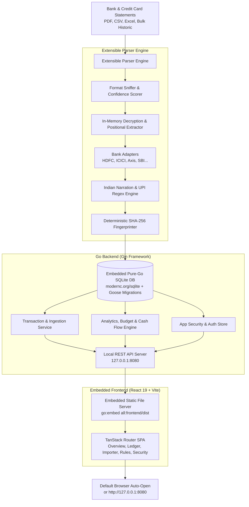

# 🇮🇳 LocalFinance

[](https://github.com/usmslm102/local-finance/actions/workflows/ci.yml)
[](LICENSE)
[](https://usamaansari.com/local-finance/)
[](https://github.com/usmslm102/local-finance/releases)
[](https://github.com/usmslm102/local-finance)

> **A privacy-first, 100% offline personal finance intelligence app tailored for the Indian banking & credit card ecosystem.**  
> Distributed as a **single standalone executable binary** with an embedded React frontend and an embedded pure-Go SQLite database.

> [!IMPORTANT]
> ### ⚖️ Disclaimer & Notice of Liability (Use at Your Own Risk)
> **LocalFinance is an independent open-source software project distributed under the terms of the [MIT License](LICENSE).**
>
> - **"AS IS" & Use at Your Own Risk**: This software is provided **"AS IS"**, without warranty of any kind, express or implied, including but not limited to the warranties of merchantability, fitness for a particular purpose, and non-infringement. You use this application entirely at your own discretion and risk.
> - **No Financial, Tax, or Legal Advice**: LocalFinance is an offline analytical and record-keeping tool. It does not provide financial planning, accounting, investment, tax, or legal advice.
> - **No Banking Affiliation**: LocalFinance is completely independent and is not affiliated with, endorsed by, sponsored by, or connected to HDFC Bank, ICICI Bank, Axis Bank, State Bank of India (SBI), the Reserve Bank of India (RBI), or any other financial institution. All bank names, brand trademarks, and logos are property of their respective owners and are referenced solely for identification and parser compatibility.
> - **Zero Liability**: To the maximum extent permitted by applicable law, in no event shall the authors, maintainers, copyright holders, or contributors be held liable for any claim, damages, losses, or legal liabilities—whether in contract, tort (including negligence), or otherwise—arising from, out of, or in connection with the software, its calculations, parser extractions, categorization rules, data loss, miscalculated figures, financial decisions, tax assessments, or any consequences resulting from its use.
> - **User Responsibility**: Users are solely responsible for reviewing and verifying the accuracy of all imported transactions, balances, and calculations against their original official bank and credit card statements before taking any financial action.

---

## 🌟 Key Highlights

- **100% Offline & Private**: Zero cloud sync, zero telemetry, no SMS scraping, and no third-party account aggregators. All your financial data stays strictly on your local machine in an open SQLite database file (`local_finance.db` or `~/.localfinance/local_finance.db`).
- **Single-Binary Portability**: Built in **Go (Golang)** with the React 19 single-page app bundled directly into the executable via `go:embed`. Cross-compiles across Windows (`.exe`), macOS, and Linux with zero CGO dependencies (`CGO_ENABLED=0`).
- **Zero-Config Database Migrations**: Schema migrations managed automatically via embedded Goose (`github.com/pressly/goose/v3`) on startup—no external migration CLI needed.
- **Generic & Extensible Parser Engine**: Pluggable architecture that **auto-detects** bank formats, account types (Savings, Current, Credit Cards), and file structures (PDF, CSV, Excel/XLS/XLSX).
- **Native Password-Protected PDF Support**: Upload encrypted bank statements directly through the UI; LocalFinance decrypts and parses them in-memory without altering original file formatting.
- **Multi-Account & Multi-Year Bulk Statements**: Handles 10+ year bulk historic statements without missing records, correctly distinguishing multiple accounts (e.g. separate HDFC Savings and Current accounts).
- **Indian Narration Intelligence**: Native regex cleaning engine for:
  - **UPI Transfers**: Extracts Payee names, VPAs (e.g., `merchant@icici`, `user@okaxis`), Reference/UTR numbers, and apps used (GPay, PhonePe, Paytm).
  - **Card Swipes / POS**: Cleans raw terminal dumps (e.g., `POS 40124300 SWIGGY BANGALORE IN` &rarr; `Swiggy`).
  - **IMPS / NEFT / RTGS**: Resolves beneficiary names and 12-to-16 digit UTR numbers.
  - **ATM Withdrawals & Bank Charges**: Distinguishes cash withdrawals, SMS alert fees, AMC charges, and GST.
- **Credit Card Billing Intelligence**:
  - Automatically captures billing cycles, statement dates, payment due dates, minimum due, total due, finance charges, reward points, and cashback.
- **Duplicate Detection & Smart Upsert**:
  - Deterministic `SHA-256` transaction hashing prevents duplicates when uploading overlapping statement periods.
  - Idempotent SQLite upserts (`ON CONFLICT`) safely update balances while **strictly preserving** your custom category overrides, notes, and tags.
- **Optional Local Security / Password Protection**:
  - Protect local database access with an optional PIN/password stored with PBKDF2/argon2 hashing, complete with automatic lock timeout.
- **Modern Interactive Dashboard**:
  - Built with **React 19**, **TypeScript**, **Tailwind CSS v4**, **TanStack Router**, **TanStack Table**, and **Recharts**.

---

## 🏦 Supported Banks & Statements Matrix

LocalFinance features dedicated parsers for major Indian banks, with native extraction of statements in PDF (including password-encrypted files decrypted losslessly in memory), CSV, and Excel formats.

### Compatibility Matrix

| Bank | Savings Account | Current Account | Core / Premium CC | Swiggy HDFC | Amazon Pay ICICI | Flipkart Axis | RuPay UPI CC | Supported Formats |
| :--- | :---: | :---: | :---: | :---: | :---: | :---: | :---: | :--- |
| **HDFC Bank** | ✅ Supported | ✅ Supported | ✅ Supported <br><sub>*(Regalia, Millennia, Infinia)*</sub> | ✅ Supported | ➖ *(N/A)* | ➖ *(N/A)* | ✅ Supported <br><sub>*(Tata Neu, RuPay)*</sub> | PDF, CSV, Excel (`.xls`, `.xlsx`) |
| **ICICI Bank** | ✅ Supported | ⏳ Planned | ✅ Supported <br><sub>*(Coral, Rubyx, Sapphiro)*</sub> | ➖ *(N/A)* | ✅ Supported | ➖ *(N/A)* | ⏳ Planned | PDF (Savings, Credit Card) |
| **Union Bank of India** | ✅ Supported | ⏳ Planned | ⏳ Planned | ➖ *(N/A)* | ➖ *(N/A)* | ➖ *(N/A)* | ⏳ Planned | PDF (Savings) |
| **Axis Bank** | ⏳ Planned <sup>*</sup> | ⏳ Planned | ✅ Supported <br><sub>*(ACE, Magnus, Atlas, Neo)*</sub> | ➖ *(N/A)* | ➖ *(N/A)* | ✅ Supported | ⏳ Planned | PDF (Credit Card) |
| **State Bank of India (SBI)** | ⏳ Planned <sup>*</sup> | ⏳ Planned | ⏳ Planned | ➖ *(N/A)* | ➖ *(N/A)* | ➖ *(N/A)* | ⏳ Planned | Generic CSV |
| **Kotak Mahindra Bank** | ⏳ Planned <sup>*</sup> | ⏳ Planned | ⏳ Planned | ➖ *(N/A)* | ➖ *(N/A)* | ➖ *(N/A)* | ⏳ Planned | Generic CSV |

> <sup>*</sup> **Universal CSV Support**: Any bank statement exported as CSV (including SBI, Kotak, ICICI Savings, etc.) can be parsed and ingested using LocalFinance's built-in delimiter-sniffing generic CSV engine.

Synthetic ICICI and Union Bank savings PDFs in `samples/savings/` exercise parser detection and full PDF extraction in the test suite. They contain only fabricated names, descriptions, dates, and amounts. Regenerate these fixtures with `go run ./cmd/generate_bank_history_samples`.

### Credit Card Variants Breakdown

| Bank | Card Variant / Series | Network | Supported Formats | Extracted Intelligence | Status |
| :--- | :--- | :---: | :--- | :--- | :---: |
| **HDFC Bank** | **Regalia / Regalia Gold** | VISA | PDF, CSV | Billing period, due date, reward points, credit limit | ✅ Supported |
| **HDFC Bank** | **Millennia** | VISA / MC | PDF, CSV | Billing period, due date, cashback, reward points | ✅ Supported |
| **HDFC Bank** | **Infinia** | VISA | PDF, CSV | Billing period, due date, reward points, credit limit | ✅ Supported |
| **HDFC Bank** | **Swiggy HDFC** | Mastercard | PDF, CSV | Cashback earned & credited, billing period, due date | ✅ Supported |
| **HDFC Bank** | **Tata Neu / RuPay UPI** | RuPay | PDF, CSV | UPI merchant transactions, NeuCoins/rewards, due date | ✅ Supported |
| **ICICI Bank** | **Amazon Pay ICICI** | VISA | PDF | 5%/2%/1% cashback calculation, due dates, reward tracking | ✅ Supported |
| **ICICI Bank** | **Coral / Rubyx / Sapphiro** | VISA / MC | PDF | Purchases/charges, reward points, limits, due dates | ✅ Supported |
| **Axis Bank** | **Flipkart Axis** | Mastercard / VISA | PDF | Cashback earned & credited, merchant categories, due dates | ✅ Supported |
| **Axis Bank** | **ACE / Magnus / Atlas / Neo** | VISA / MC | PDF | Itemized spends, reward points, credit limits, due dates | ✅ Supported |

---

## 🏗️ Architecture



---

## 🛠️ Technology Stack

| Layer | Component | Description |
| :--- | :--- | :--- |
| **Backend Core** | **Go 1.22+** (Go 1.26 toolchain) | High-performance, low-memory footprint, single-binary compilation with `CGO_ENABLED=0`. |
| **API Framework** | **Gin (`gin-gonic/gin`)** | High-speed HTTP router, multipart file upload handling, CORS, and embedded static asset serving. |
| **Database Engine** | **SQLite (`modernc.org/sqlite`)** | Pure Go SQLite engine (zero CGO required), WAL mode enabled with busy timeout pragmas. |
| **Schema Migrations** | **Goose (`pressly/goose/v3`)** | Embedded SQL migrations executed automatically on startup via `embed.FS`. |
| **Asset Embedding** | **Go `embed`** | Packages the compiled React production bundle directly into the Go binary. |
| **Frontend Framework**| **React 19 + TypeScript + Vite** | High-speed modern UI with type-safety and hot module replacement. |
| **Package Manager** | **`pnpm`** | Strict dependency resolution (use `pnpm` exclusively for all frontend tasks). |
| **UI Components** | **shadcn/ui + Radix UI** | Accessible, headless UI components styled with Tailwind CSS. |
| **Routing** | **TanStack Router** | Client-side routing for `/`, `/transactions`, `/import`, `/categories`, `/settings`. |
| **Table & Ledger** | **TanStack Table v8** | Virtualized transaction table with multi-column sorting, filtering, and pagination. |
| **State & Fetching** | **TanStack Query v5** | Server-state caching and automatic cache invalidation on imports. |
| **Styling** | **Tailwind CSS v4** | Modern design tokens and dark financial aesthetic. |
| **Visualizations** | **Recharts** | Interactive donut spending breakdown and cash flow bar charts. |

---

## 🚀 Running & Developing LocalFinance

### ⚡ Quick Start: Pre-built Standalone Binaries
You don't need Go or Node.js installed to use LocalFinance. Download the pre-compiled binary for your system from **[GitHub Releases](https://github.com/usmslm102/local-finance/releases)**.

#### 🍎 macOS (Apple Silicon M1/M2/M3/M4 & Intel)
When running downloaded binaries on macOS, Gatekeeper may display a security dialog:
> *"local-finance-darwin-arm64" Not Opened — Apple could not verify that it is free of malware...*

This is standard macOS protection for open-source binaries distributed outside the Mac App Store without an Apple Developer ID signature.

**To run the binary:**
- **Terminal (Fastest)**: Remove the download quarantine attribute and grant execution permission:
  ```bash
  # For Apple Silicon (M1/M2/M3/M4):
  xattr -d com.apple.quarantine ~/Downloads/local-finance-darwin-arm64
  chmod +x ~/Downloads/local-finance-darwin-arm64
  ~/Downloads/local-finance-darwin-arm64

  # For Intel Mac:
  xattr -d com.apple.quarantine ~/Downloads/local-finance-darwin-amd64
  chmod +x ~/Downloads/local-finance-darwin-amd64
  ~/Downloads/local-finance-darwin-amd64
  ```
- **Finder**:
  1. Click **Done** on the alert dialog.
  2. In Finder, **Right-click** (or **Control-click**) the executable file.
  3. Click **Open** from the menu, then click **Open** on the confirmation prompt.  
  *(Alternatively: Go to **System Settings** → **Privacy & Security**, scroll down to **Security**, and click **Open Anyway**).*

#### 🪟 Windows
1. Download `local-finance-windows-amd64.exe` from Releases.
2. Double-click to launch. If Windows SmartScreen appears (*"Windows protected your PC"*), click **More info** → **Run anyway**.

#### 🐧 Linux
```bash
chmod +x local-finance-linux-amd64
./local-finance-linux-amd64
```

---

### Prerequisites (For Building from Source)
- **Go 1.22+** (configured with Go 1.26 toolchain)
- **Node.js 20+**
- **pnpm** (install via `npm install -g pnpm` or `brew install pnpm`)

---

### Development Workflows

#### 1. Quick Unified Run (`make dev` or `make serve`)
Compiles the React frontend and boots up the Go server with auto-browser opening:
```bash
make dev
```

#### 2. Live Development Mode (Dual Process with Hot Reload)
When actively building React UI components or making backend changes:

* **Terminal 1: Go Backend Server**
  ```bash
  make dev-backend
  # Or manually:
  go run ./cmd/server/main.go -port 8080 -db ./local_finance.db -open=false
  ```
  *(Optional: Use [`air`](https://github.com/air-verse/air) for live Go auto-recompilation: `air -c .air.toml`)*

* **Terminal 2: Frontend Vite Dev Server**
  ```bash
  make dev-frontend
  # Or manually:
  cd frontend && pnpm dev
  ```
  Open **`http://localhost:5173`** in your browser. All UI edits reflect instantly via Hot Module Replacement (HMR), and API requests (`/api/*`) are automatically proxied to the Go backend on port `8080`.

#### 3. Production Build (Single Standalone Binary)
Builds the production React bundle, embeds it into Go, and outputs the standalone executable:
```bash
make build
# Or manually:
cd frontend && pnpm build && cd .. && go build -o local-finance ./cmd/server/main.go
```

#### 4. Run the Production Binary
```bash
./local-finance -port 8080 -open
```

#### Available CLI Flags:
| Flag | Default | Description |
| :--- | :--- | :--- |
| `-port` | `8080` | Port for the local HTTP server. |
| `-db` | `~/.localfinance/local_finance.db` | Path to the SQLite database file. |
| `-open` | `true` | Automatically opens the application in your default web browser on startup (`-open=false` to disable). |

#### 5. Clean Build Artifacts
```bash
make clean
# Deletes frontend/dist, compiled binary, and test databases
```

#### 6. Run Automated Tests
```bash
make test
# Or:
go test -v ./...
```

---

### Cross-Compiling for Other Operating Systems

Because LocalFinance uses pure Go SQLite (`modernc.org/sqlite`), cross-compilation requires **zero CGO** (`CGO_ENABLED=0`):

```bash
# 1. Build frontend assets
cd frontend && pnpm build && cd ..

# 2. Compile for macOS (Apple Silicon M1/M2/M3/M4)
GOOS=darwin GOARCH=arm64 go build -o local-finance-darwin-arm64 ./cmd/server/main.go

# 3. Compile for macOS (Intel x86_64)
GOOS=darwin GOARCH=amd64 go build -o local-finance-darwin-amd64 ./cmd/server/main.go

# 4. Compile for Windows 64-bit (.exe)
GOOS=windows GOARCH=amd64 go build -o local-finance-windows-amd64.exe ./cmd/server/main.go

# 5. Compile for Linux 64-bit
GOOS=linux GOARCH=amd64 go build -o local-finance-linux-amd64 ./cmd/server/main.go
```

---

## 🔒 Password-Protected PDF Statements & Optional Decryption

### Native Decryption (Recommended)
You do **not** need to decrypt or remove passwords from your statements before uploading!
- LocalFinance natively decrypts protected PDF statements in memory using the password input in the upload modal.
- It parses the full multi-page document in its native layout without touching your filesystem or saving decrypted files to disk.

---

### ⚠️ Avoid macOS Preview "Print to PDF"
When removing passwords from bank statements, **do not** use **File &rarr; Print &rarr; Save as PDF** in macOS Preview:
1. **Canvas Rescaling**: Preview's virtual printer often downsizes wide/landscape bank statements (e.g. from 730 pt landscape down to 245 pt portrait), which can break column alignments in standard parsers.
2. **Missing Pages**: The print dialog frequently defaults to printing **only Page 1**, accidentally truncating multi-page statements (e.g. losing 13 out of 14 pages).

---

### 💡 How to Safely Remove Passwords via `qpdf` (Lossless)

If you wish to remove passwords from bank statements for local archival or inspection, the safest and cleanest utility is **`qpdf`**.

`qpdf` performs a **pure cryptographic decryption** on the PDF binary stream without re-rendering, rescaling, or rasterizing vector coordinates:

#### 1. Install `qpdf`
* **macOS** (Homebrew):
  ```bash
  brew install qpdf
  ```
* **Ubuntu / Debian**:
  ```bash
  sudo apt install qpdf
  ```
* **Windows** (Chocolatey or Scoop):
  ```bash
  choco install qpdf
  # Or: scoop install qpdf
  ```

#### 2. Decrypt Statement
```bash
qpdf --decrypt --password="YOUR_PASSWORD" "protected_statement.pdf" "unlocked_statement.pdf"
```

#### 3. Batch Decrypt All Statements in a Folder (macOS/Linux)
```bash
for f in *.pdf; do
    qpdf --decrypt --password="YOUR_PASSWORD" "$f" "unlocked_${f}"
done
```

> **Why `qpdf`?** It preserves 100% of the original PDF layout, font streams, page counts, and coordinate dimensions with zero data loss.

---

#### Alternative GUI Method: macOS Preview "Export" (Not Print)
If you prefer not to use the terminal:
1. Open the protected PDF in **Preview** and enter your password.
2. Click **File &rarr; Export...** (do **NOT** use *Export as PDF* or *Print*).
3. In the export dialog, ensure the **Encrypt** checkbox is **unchecked**.
4. Save the file. This preserves all pages and canvas dimensions.

---

## 📁 Repository Structure

```
local-finance/
├── cmd/
│   └── server/
│       └── main.go  …7325 tokens truncated…eta, fmt.Errorf("%s statement contains a dated transaction without narration", profile.bankName)
		}
		cleaned := CleanNarration(narration)
		ref := bankHistoryReference(row, columns)
		if ref == "" {
			ref = cleaned.ReferenceNumber
		}
		parsed = append(parsed, bankHistoryRow{tx: ParsedTransaction{
			Date: date, RawNarration: narration, CleanedPayee: cleaned.CleanedPayee,
			PaymentMode: cleaned.PaymentMode, ReferenceNumber: ref, TxType: direction,
			Amount: amount, IsTransfer: cleaned.IsTransfer,
		}, balance: balance})
	}
	if len(parsed) == 0 {
		return nil, meta, fmt.Errorf("%s transaction table contains no complete rows", profile.bankName)
	}

	// Normalize source ordering before checking every adjacent running balance.
	sort.SliceStable(parsed, func(i, j int) bool { return parsed[i].tx.Date < parsed[j].tx.Date })
	debits, credits := 0.0, 0.0
	for index, row := range parsed {
		if row.tx.TxType == models.TxTypeDebit {
			debits += row.tx.Amount
		} else {
			credits += row.tx.Amount
		}
		previous := row.balance
		if row.tx.TxType == models.TxTypeCredit {
			previous -= row.tx.Amount
		} else {
			previous += row.tx.Amount
		}
		if index == 0 {
			if !openingFound {
				meta.OpeningBalance = previous
			} else if !historyMoneyEqual(meta.OpeningBalance, previous) {
				return nil, meta, fmt.Errorf("%s opening balance does not reconcile with its first running balance", profile.bankName)
			}
			continue
		}
		if !historyMoneyEqual(parsed[index-1].balance, previous) {
			return nil, meta, fmt.Errorf("%s running balances do not reconcile between dated transactions", profile.bankName)
		}
	}
	if !closingFound {
		meta.ClosingBalance = parsed[len(parsed)-1].balance
	} else if !historyMoneyEqual(meta.ClosingBalance, parsed[len(parsed)-1].balance) {
		return nil, meta, fmt.Errorf("%s closing balance does not match the last running balance", profile.bankName)
	}
	if debitTotalFound && !historyMoneyEqual(meta.TotalDebits, debits) {
		return nil, meta, fmt.Errorf("%s withdrawals do not match the printed debit total", profile.bankName)
	}
	if creditTotalFound && !historyMoneyEqual(meta.TotalCredits, credits) {
		return nil, meta, fmt.Errorf("%s deposits do not match the printed credit total", profile.bankName)
	}
	if meta.TotalDebits == 0 {
		meta.TotalDebits = debits
	}
	if meta.TotalCredits == 0 {
		meta.TotalCredits = credits
	}
	if meta.OpeningBalance+credits-debits-meta.ClosingBalance > 0.01 || meta.ClosingBalance-(meta.OpeningBalance+credits-debits) > 0.01 {
		return nil, meta, fmt.Errorf("%s opening balance, transactions, and closing balance do not reconcile", profile.bankName)
	}
	if meta.StartDate == "" || meta.EndDate == "" {
		meta.StartDate, meta.EndDate = parsed[0].tx.Date, parsed[len(parsed)-1].tx.Date
	}
	transactions := make([]ParsedTransaction, len(parsed))
	for index := range parsed {
		balance := parsed[index].balance
		transactions[index] = parsed[index].tx
		transactions[index].RunningBalance = &balance
	}
	return transactions, meta, nil
}

func discoverBankHistoryColumns(row extractor.PositionalRow, profile bankHistoryProfile) (bankHistoryColumns, bool) {
	text := bankHistoryRowText(row)
	upper := strings.ToUpper(text)
	if !containsAllBankTerms(upper, profile.recognition) {
		return bankHistoryColumns{}, false
	}
	columns := bankHistoryColumns{date: -1, description: -1, debit: -1, credit: -1, balance: -1, reference: -1}
	for _, element := range row.Elements {
		label := strings.ToUpper(strings.Join(strings.Fields(element.S), " "))
		switch {
		case columns.date < 0 && matchesBankTerm(label, profile.dateHeaders):
			columns.date = element.X
		case columns.description < 0 && matchesBankTerm(label, profile.description):
			columns.description = element.X
		case columns.debit < 0 && matchesBankTerm(label, profile.debitHeaders):
			columns.debit = element.X
		case columns.credit < 0 && matchesBankTerm(label, profile.creditHeaders):
			columns.credit = element.X
		case columns.balance < 0 && matchesBankTerm(label, profile.balanceHeaders):
			columns.balance = element.X
		case !columns.hasReference && matchesBankTerm(label, profile.reference):
			columns.reference, columns.hasReference = element.X, true
		}
	}
	if columns.date < 0 || columns.description < 0 || columns.debit < 0 || columns.credit < 0 || columns.balance < 0 {
		return bankHistoryColumns{}, false
	}
	if !(columns.date < columns.description && columns.description < columns.debit && columns.debit < columns.credit && columns.credit < columns.balance) {
		return bankHistoryColumns{}, false
	}
	return columns, true
}

func containsAllBankTerms(text string, terms []string) bool {
	for _, term := range terms {
		if !strings.Contains(text, strings.ToUpper(term)) {
			return false
		}
	}
	return true
}

func matchesBankTerm(text string, terms []string) bool {
	for _, term := range terms {
		if strings.Contains(text, strings.ToUpper(term)) {
			return true
		}
	}
	return false
}

func bankHistoryRowText(row extractor.PositionalRow) string {
	parts := make([]string, 0, len(row.Elements))
	for _, element := range row.Elements {
		parts = append(parts, strings.TrimSpace(element.S))
	}
	return strings.Join(parts, " ")
}

func bankHistoryDocumentText(rows []extractor.PositionalRow) string {
	var lines []string
	for _, row := range rows {
		lines = append(lines, bankHistoryRowText(row))
	}
	return strings.Join(lines, "\n")
}

func bankHistoryDateCell(row extractor.PositionalRow, dateX, descriptionX float64) (int, string) {
	for index, element := range row.Elements {
		if element.X < dateX-10 || element.X >= descriptionX {
			continue
		}
		value := strings.TrimSpace(element.S)
		if bankHistoryDatePrefix.MatchString(value) {
			return index, bankHistoryDatePrefix.FindString(value)
		}
	}
	return -1, ""
}

func strictIndianDate(raw string) string {
	normalized := extractor.NormalizeIndianDate(raw)
	if _, err := time.Parse("2006-01-02", normalized); err != nil {
		return ""
	}
	return normalized
}

func amountInBankColumn(row extractor.PositionalRow, start, end float64) (float64, bool, error) {
	cell := bankHistoryCellInColumn(row, start, end)
	if cell == "" || cell == "-" || cell == "--" {
		return 0, false, nil
	}
	match := bankHistoryAmount.FindStringSubmatch(cell)
	if len(match) != 3 {
		return 0, false, fmt.Errorf("invalid amount cell")
	}
	amount, err := extractor.ParseIndianAmount(match[1])
	if err != nil || amount < 0 {
		return 0, false, fmt.Errorf("invalid amount value")
	}
	return amount, amount > 0, nil
}

func bankHistoryCellInColumn(row extractor.PositionalRow, start, end float64) string {
	var values []string
	for _, element := range row.Elements {
		if element.X < start || (end > start && element.X >= end) {
			continue
		}
		value := strings.TrimSpace(element.S)
		if value != "" {
			values = append(values, value)
		}
	}
	return strings.Join(values, " ")
}

func bankHistoryNarration(row extractor.PositionalRow, columns bankHistoryColumns) string {
	var parts []string
	for _, element := range row.Elements {
		if element.X < columns.description || element.X >= columns.debit || (columns.hasReference && element.X >= columns.reference && element.X < columns.debit) {
			continue
		}
		value := strings.TrimSpace(element.S)
		if bankHistoryDatePrefix.MatchString(value) {
			continue
		}
		if _, err := extractor.ParseIndianAmount(value); err == nil && bankHistoryMoneyToken.MatchString(value) {
			continue
		}
		parts = append(parts, value)
	}
	return strings.TrimSpace(strings.Join(parts, " "))
}

func bankHistoryReference(row extractor.PositionalRow, columns bankHistoryColumns) string {
	if !columns.hasReference {
		return ""
	}
	for _, element := range row.Elements {
		if element.X < columns.reference || element.X >= columns.debit {
			continue
		}
		value := strings.TrimSpace(element.S)
		if value != "" && !bankHistoryDatePrefix.MatchString(value) {
			return value
		}
	}
	return ""
}

func parseLabeledHistoryAmount(pattern *regexp.Regexp, line string) (float64, bool) {
	if pattern == nil {
		return 0, false
	}
	match := pattern.FindStringSubmatch(line)
	if len(match) < 2 {
		return 0, false
	}
	amount, err := extractor.ParseIndianAmount(match[1])
	if err != nil || amount < 0 {
		return 0, false
	}
	if len(match) > 2 && strings.EqualFold(strings.TrimSpace(match[2]), "DR") {
		return -absFloat(amount), true
	}
	return absFloat(amount), true
}

func historyMoneyEqual(a, b float64) bool { return absFloat(a-b) <= 0.01 }

func absFloat(value float64) float64 {
	if value < 0 {
		return -value
	}
	return value
}
